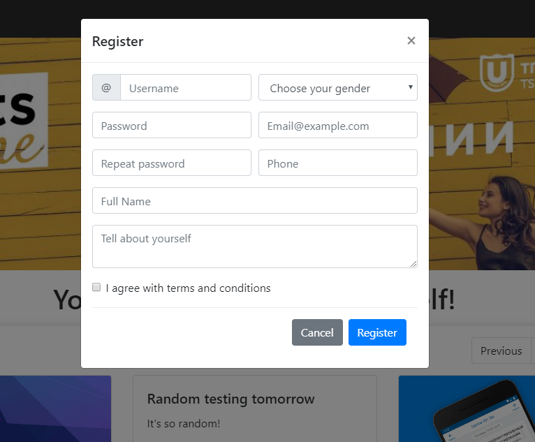

# Frontend: Final attempt (2/2). 
## Task
Your task is to develop a responsive website. In this task you should use Bootstrap.
For icons you should use FontAwesome (already included). 

  
*Full layout view (1920px)*

When you click "Register" animated popup with registration form appears: 

  
*Registration popup*

You should also make your content (news items with pictures and short news – first and second columns) generatable.
It means that every time you refresh a page you create new sets of cards: picture, title and description are linked together (for each picture there is specific title and description (which can be empty)).

You should use SCSS and create a gulpfile by yourself. All CSS should be generated from SCSS.

[Video](https://drive.google.com/open?id=1eBHMbN8NkVsColsGoZLE5H0W_K80Xixr)
*Registration and full page view*

[Video](https://drive.google.com/open?id=1oIXt2qVg3pnZsBZI9Dmg728_jO8JzK_l)
*Pagination demo*

[Video](https://drive.google.com/open?id=1qIVOxKONO2DqdVbE5zLr3X6vUDDdTMJw)
*Responsive layout and popups demo*

[Video](https://drive.google.com/open?id=1M5N3S0XzlS-47bdW55N2yJM380NOIqjr)
*Generation demo*

As you can see after page is rendered news items as always the same for each page. It means that on every page there is specific set of news items. When you change page set is being rendered. When you go back set for previous page is still same. Only when on refresh sets for each page is being generated. 

### Extra task

Since initial task wasn't changed I've added new tasks that you HAVE to finish until meeting. 

1. News on each page shouldn't repeat. 
2. You have to use SCSS (and setup auto generation of css from SCSS). 
3. Each popup (window that appear when you click on a news) should contain info that corresponds with news item that was clicked.

## Rules 
Since this task is special case of exam attempt it means that it either done completely or failed. **Small** flaws are permitted. 
 
You have to complete whole task before coming to IRL meeting (18.09.2019@12:25).  

During IRL meeting you will receive extra task (which is secret until you get it) that you have to finish in 30 minutes. This extra task will require HTML, CSS and JS modification. For example you might be asked to add extra rules to news generation (changing order, content or other). 

If you succeed on finishing extra task you will have 10 more minutes for theoretical questions. It's enough to answer properly to 3 out of 5 questions to pass. 

If you pass home work, extra task and theoretical questions you will pass frontend exam and receive 3 as your grade. 

As always any attempt to communicate with anyone but me will fail your exam. You SHOULD NOT work on your exam with anyone else. If your code will be similar (not same but look like some one helped you) you will receive extra questions: you have to answer all of them (they will be about code that is similar with some ones).  